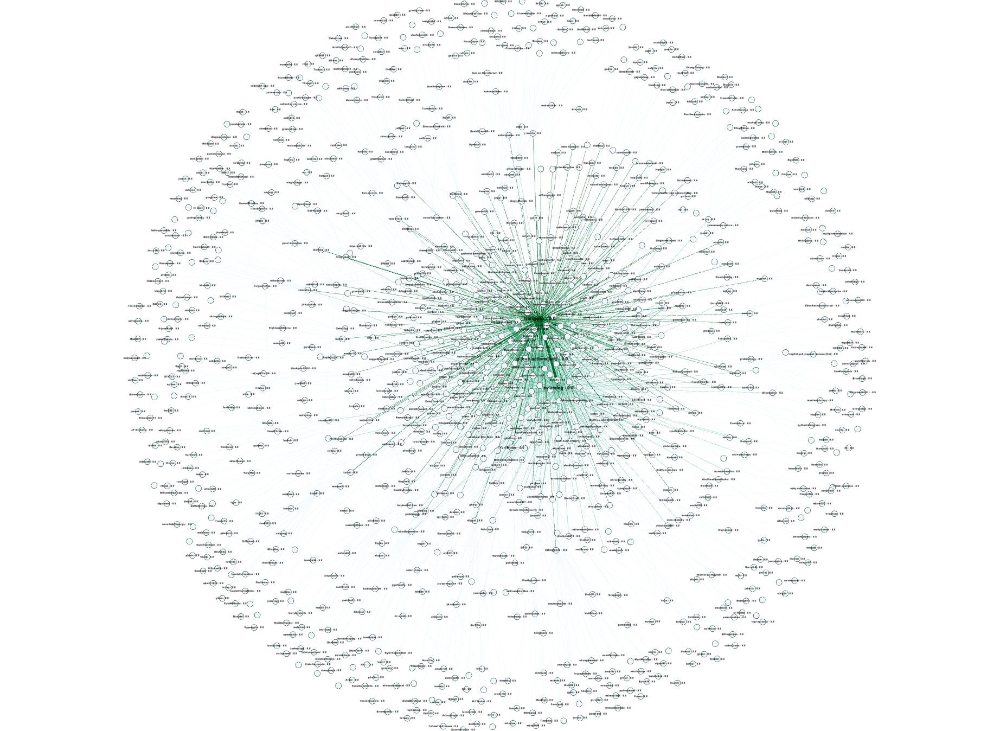

# Trabalho Prático — Teoria de Grafos (PUC Minas)

Ferramenta para minerar colaboração no repositório **[fastapi/typer](https://github.com/fastapi/typer)** (~19,5k estrelas), modelar grafos de interação e calcular métricas de redes.

## Estrutura

| Pasta / arquivo | Conteúdo |
| --------------- | --------- |
| `Documentacao/` | Pasta reservada para arquivos de texto e documentações |
| `Etapa 1/` | Coleta GitHub, mineração e construção dos 4 grafos |
| `Etapa 2/` | `AbstractGraph`, matriz, lista, exportação Gephi e demo |
| `Etapa 3/` | Métricas de rede, centralidades, densidade, comunidades |
| `Modelagem/` | Pasta reservada para arquivos de diagrama de classe e grafos |
| `main.py` | Pipeline completo interativo e configuração de paths |

## Diagrama de Classes

O sistema foi modelado utilizando UML, contemplando as classes responsáveis pela mineração de dados do GitHub, construção dos grafos e cálculo das métricas de redes.


## Grafos gerados (modelagem)

1. **Grafo 1** — comentários em issues/PRs
2. **Grafo 2** — fechamento de issues
3. **Grafo 3** — revisões/aprovações/merges de PRs
4. **Grafo integrado** — pesos: comentário=2, issue comentada=3, revisão=4, merge=5

Cada usuário GitHub é um vértice; arestas direcionadas `origem → alvo`.

## Como executar

### Configuração (`.env`)

1. Copie o exemplo:

**Windows (CMD):**
```cmd
copy .env.example .env
```

**Windows (PowerShell):**
```powershell
Copy-Item .env.example .env
```

**Linux / macOS:**
```bash
cp .env.example .env
```

2. Edite `.env` e preencha pelo menos:

```env
GITHUB_TOKEN=seu_token_aqui
REPO=fastapi/typer
OFFLINE=false
MAX_ISSUES=0
MAX_PULLS=0
```

O `main.py` **carrega o `.env` automaticamente** ao iniciar. Você **não precisa** exportar o token no terminal se ele já estiver no `.env`.

> **Importante:** o arquivo `.env` não vai para o GitHub (está no `.gitignore`). Nunca commite seu token.

Crie o token em: https://github.com/settings/tokens (escopo `public_repo` ou `repo`).

---

### 1) Modo offline (sem token — para testar)

No `.env`, use `OFFLINE=true`, ou rode:

**Windows:**
```bash
python main.py --offline
```

**Linux / macOS:**
```bash
python3 main.py --offline
```

Gera em `output/` os `.graphml` e `metricas_integrado.json`.

---

### 2) Mineração real do Typer

Com o `.env` configurado, basta:

**Windows:**
```bash
python main.py
```

**Linux / macOS:**
```bash
python3 main.py
```

O script usa os valores do `.env` (`GITHUB_TOKEN`, `REPO`, `MAX_ISSUES`, `MAX_PULLS`, etc.).

**Alternativa:** definir o token só na sessão atual do terminal (sobrescreve o `.env`).

**Windows PowerShell:**
```powershell
$env:GITHUB_TOKEN = "seu_token_aqui"
python main.py
```

**Linux / macOS (bash/zsh):**
```bash
export GITHUB_TOKEN="seu_token_aqui"
python3 main.py
```

Use `MAX_ISSUES=0` e `MAX_PULLS=0` no `.env` para minerar tudo. Em repositórios grandes, isso pode levar bastante tempo e consumir muitas chamadas de API.

---

### 3) Demo da API de grafos (Etapa 2)

**Windows:**
```bash
python "Etapa 2/demo_app.py"
```

**Linux / macOS:**
```bash
python3 "Etapa 2/demo_app.py"
```

---

### 4) Testes

Como as pastas foram divididas por etapa, você precisa incluir elas no `PYTHONPATH` para rodar os testes.

#### Windows (PowerShell)

```powershell
$env:PYTHONPATH = "Etapa 1;Etapa 2;Etapa 3"

python -m unittest discover -s "Etapa 1/tests" -p "test*.py" -v
python -m unittest discover -s "Etapa 2/tests" -p "test*.py" -v
python -m unittest discover -s "Etapa 3/tests" -p "test*.py" -v
```

#### Linux / macOS

```bash
export PYTHONPATH="Etapa 1:Etapa 2:Etapa 3"

python3 -m unittest discover -s "Etapa 1/tests" -p "test*.py" -v
python3 -m unittest discover -s "Etapa 2/tests" -p "test*.py" -v
python3 -m unittest discover -s "Etapa 3/tests" -p "test*.py" -v
```

## Plano de aceitação — Etapa 2 (API de grafos)

| Requisito | Teste | Resultado esperado |
| --------- | ----- | ------------------ |
| `getVertexCount()` | `test_getVertexCount` | Retorna o número de vértices do construtor |
| `getEdgeCount()` / `hasEdge()` | `test_add_edge_idempotent_and_counts` | Contagem correta; `hasEdge` reflete estado |
| `addEdge` idempotente | `test_add_edge_idempotent_and_counts` | Segunda chamada não duplica aresta |
| Sem laços | `test_disallow_self_loops` | `ValueError` em `addEdge(u,u)` |
| `removeEdge` inconsistente | `test_remove_edge_inconsistent_raises` | `ValueError` se aresta não existe |
| Pesos de vértice | `test_set_get_vertex_weights` | `set`/`get` com valor numérico |
| Pesos de aresta | `test_set_get_edge_weights_only_if_edge_exists` | Só em aresta existente; senão `ValueError` |
| `isSucessor` / `isPredessor` | `test_isSucessor_isPredessor` | Coerente com direção do arco |
| `isDivergent` / `isConvergent` / `isIncident` | `test_isDivergent_isConvergent_isIncident` | Verdadeiro só quando arcos existem |
| Graus | `test_degrees` | In/out degree corretos |
| `isConnected` (fraca) | `test_isConnected_weak` | `False` desconectado; `True` conectado |
| `isEmptyGraph` / `isCompleteGraph` | `test_empty_and_complete_graph` | Vazio sem arestas; completo com `n(n-1)` arcos |
| `exportToGEPHI` | `test_exportToGEPHI_graphml` | Arquivo GraphML não vazio |
| Índices inválidos | `test_invalid_vertex_index_raises`, `test_invalid_edge_index_on_weight_ops_raises` | `IndexError` |
| Construtor inválido | `test_invalid_num_vertices_constructor` | `ValueError` ou `TypeError` |
| Tipos inválidos | `test_invalid_vertex_type_raises` | `TypeError` |

Demonstração manual de todas as operações:

**Windows:**
```bash
python demo_app.py
```

**Linux / macOS:**
```bash
python3 demo_app.py
```

## Plano de aceitação — Etapa 1 (mineração)

| Requisito | Teste | Resultado esperado |
| --------- | ----- | ------------------ |
| Comentário em issue gera `COMMENT` + `ISSUE_OPEN_COMMENTED` | `test_extractor.test_issue_comment_generates_*` | Dois registros, `bob→alice` |
| Comentário em PR gera só `COMMENT` | `test_extractor.test_pr_comment_generates_only_comment` | Sem `ISSUE_OPEN_COMMENTED` |
| Fechamento de issue | `test_extractor.test_issue_close_event` | `ISSUE_CLOSE` |
| Revisão/aprovação de PR | `test_extractor.test_pr_review_approved` | `PR_REVIEW` |
| Merge de PR | `test_extractor.test_pr_merge` | `PR_MERGE` |
| Ignora auto-interação | `test_extractor.test_issue_comment_ignores_self_comment` | Lista vazia |
| Pesos do grafo integrado | `test_extractor.GraphFactoryWeightTests` | Pesos 2/3/4/5 acumulados |
| Sample JSON + construção de grafos | `test_mining` | Grafos com vértices e arestas |
| Cache válido/inválido | `test_cache` | Meta compatível aceita; incompatível rejeita |

## Plano de aceitação — Etapa 3 (métricas)

| Métrica | Teste | Resultado esperado |
| ------- | ----- | ------------------ |
| Densidade | `test_metrics.test_density_directed_triangle` | `E / (n(n-1))` |
| Degree centrality | `test_metrics.test_degree_centrality_star_out` | Hub com grau máximo normalizado |
| Eigenvector centrality | `test_metrics.test_eigenvector_star_center_highest` | Maior score no hub da estrela |
| PageRank | `test_metrics.test_pagerank_positive_and_normalized` | Soma ≈ 1, valores positivos |
| Betweenness | `test_metrics.test_betweenness_path_middle_highest` | Vértice intermediário maior |
| Pipeline completo | `test_metrics.test_compute_metrics_includes_eigenvector` | Todas as métricas presentes |

## Entrega (checklist do PDF)

- [x] Código fonte (este repositório)
- [x] Relatório LaTeX (template SBC) — descrever escolha do Typer, modelagem, resultados e telas
- [x] PDF do relatório
- [x] `.zip` com código + `.tex` + PDF
- [x] Indicar no relatório o que cada integrante fez
- [x] Vídeo (5–10 min) e apresentação oral (10–15 min)
- [x] Importar `output/grafo_integrado.graphml` no Gephi para figuras do relatório

## Resultados Obtidos

Mineração realizada sobre o repositório fastapi/typer.

### Visualização do Grafo Integrado

A figura abaixo apresenta o grafo integrado gerado a partir das interações entre colaboradores do repositório fastapi/typer. Os vértices representam usuários e as arestas representam interações extraídas de comentários, fechamentos de issues, revisões e merges de pull requests.



### Grafo Integrado

- Vértices: 1129
- Arestas: 1952
- Densidade: 0.0015
- Clustering: 0.0215
- Assortatividade: -0.1695
- Modularidade: 0.3794

### Usuários mais centrais

Degree Centrality:
- tiangolo
- github-actions[bot]
- svlandeg

Betweenness Centrality:
- tiangolo
- svlandeg
- github-actions[bot]

PageRank:
- csheppard
- bcm0
- tiangolo

## Tecnologias Utilizadas

- Python 3.12
- GitHub REST API
- Gephi
- PlantUML
- LaTeX (Template SBC)
- unittest

## Autores

- Amanda Bicalho Silva
- Karen Joilly Araújo Gregório de Almeida
- Pedro Rodrigues Duarte
- Tiago Boaventura Amaral

Curso: Engenharia de Software
Pontifícia Universidade Católica de Minas Gerais (PUC Minas)

## Observações

- Não usa `networkX` nem bibliotecas prontas de grafos.
- Com `GITHUB_TOKEN` no `.env`, rode apenas `python main.py` (Windows) ou `python3 main.py` (Linux/macOS).
- Sem token, use `OFFLINE=true` no `.env` ou `python main.py --offline` (Windows) / `python3 main.py --offline` (Linux/macOS).
- Resultados reutilizáveis ficam em cache: `output/interactions_cache.json`.
